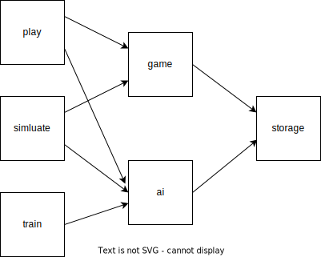
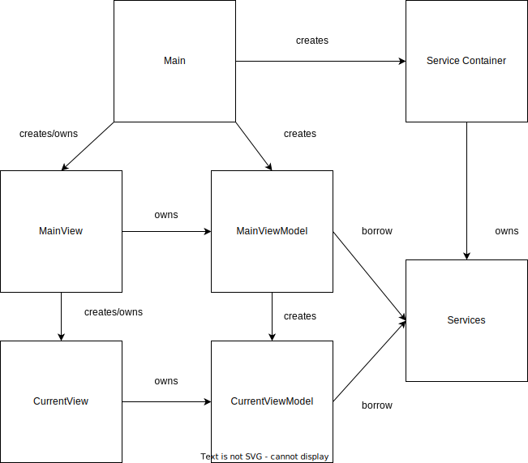

# New Game Tokio Drift

## Background

This is the third iteration of my attempt to create an sandbox app (Game, New Game Plus, now this).
My goal with this is to have an app where I can implement games, and algorithms to solve them (either my own, or ones found through research).

### Why Rust

Rust is BLAZINGLY fast.... jk. Kind of. Coming from a C++ background, I appreciate the goal of rust: To have memory safety built into the langauge.
In addition to memory safety, Rust brings modern patterns and paradigms to system programming.
I've been looking for a larger scale project that will give me an exuse to use it.

### Why a TUI

While there exist web frameworks for frontend and backend rust, they are in my opinion not justifiable to use over typescript/node for web applications.
I've also decided on prinicple that projects that require a lot of processing time, will be developed natively in rust.

## Requirements
### Use cases
- play games within an TUI environment
- simulate games to assess performance of AI's
- gather data for gathers to be fed into ML models for traning
- train ML models on gathered data

### Technical considerations
- Must be easily testable with units tests and integration tests
- Its a rust best practice to organize large projects using workspaces
- Must define an ownership model so code structure can play well with borrow checker

## Overview

**Simluate** - runs games without tui to allow for data gathering and assessing AI agents

**Play** - Plays PvC games in a tui environment

**Train** - Uses data sets to train new ML models

**Game** - Contains the common logic for running games

**AI** - Contains the logic for get trained models, and AI/ML algorithm implementations

**Storage** - Abstraction for access storage

### Play

#### Structure
The structure will follow an MVVMish one. Views will contain the logic for displaying data from ViewModels. View Models will contain logic for preparing data for the view. and Models will come from services in external libraries.

#### Ownership
**Views will own the the viewmodel.**

**Pros:** The lifetime of the viewmodel does not need to be managed differently from the lifetime of the view.

**Cons:** The viewmodel will not be hidden behind an abstraction, and cannot be mocked for unit testing.

Since this only applies to the view, there is not much lost from a unit testing perspective as most of the logic will be contained in the viewmodel which can have its dependencies mocked and unit tested.

This will also mean that the MainViewModel will mostly contain factory methods for view models

**Services will be borrowed**

The services will be owned by the service container and borrowed mutably as needed but will be hidden behind traits to enable unit testing.

#### Routing
- Main will get current route.
- Based on the current route, it will get the needed services to pass to the MainViewMdoel factory method
- Main will pass the MainViewModel to the View upon creation
- CurrentViewModel must be destoryed before a new one can be created

### Technical Decisions

#### Tools
The project will have husky for rust enabled to ensure functional tests and builds pre commit. This will also have clippy enabled to improve code quality.

#### Testing
This project will be using the default rust testing framework.

#### Persistence
Since the app will be native, sqlite will be used for persistence. To ease development effort, an ORM will be used. Specificaly sea-orm, which has the expected orm features like automated migrations and entity generation. But also allows the migrations and schema to be fully defined in rust.

#### TUI
The TUI framework that will be used in ratatui, as is the most popular.

## Implementation

- **Phase 1 (Counter)**
  - *goal:* to establish the base project structure for play game and ai
- **Phase 2 (Tic Tac Toe Play)**
  - *goal:* build on the established project structure to implement tic tac toe game
  - should include basic game flow and algorithm implementation
- **Phase 3 (Tic Tac Toe Simluate)**
  - *goal:* implement simluation scenario's for tic tac toe data gathering
- **Phase 4 (Tic Tac Toe Train)**
  - *goal:* implement a trainable ai that can be used in play