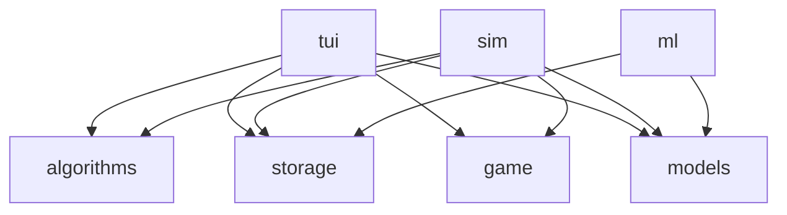

# New Game Tokio Drift

## Background

This is the third iteration of my attempt to create an sandbox app (Game, New Game Plus, now this).
My goal with this is to have an app where I can implement games, and algorithms to solve them (either my own, or ones found through research).

### Why Rust

Rust is BLAZINGLY fast.... jk. Kind of. Coming from a C++ background, I appreciate the goal of rust: To have memory safety built into the langauge.
In addition to memory safety, Rust brings modern patterns and paradigms to system programming.
I've been looking for a larger scale project that will give me an exuse to use it.

### Why a TUI

While there exist web frameworks for frontend and backend rust, they are in my opinion not justifiable to use over typescript/node for web applications.
I've also decided on prinicple that projects that require a lot of processing time, will be developed natively in rust.

## Project Structure (Tenative)

- **tui** _(Binary)_: the front end that will be used to run games in tui form

- **game** _(Library)_: where game logic will be kept

- **sim** _(Binary)_: used to simulate games. Particularly for gathering data, or running two algorithms against each other

- **algorithms** _(Library)_: where all algorithms ares kept. They will need to be generic enough to use in multiple contexts

- **models** _(Library)_: store trained models for use in other packages

- **storage** _(Library)_: store data to database (sqlite since the app is native)

- **ml** _(Binary)_: train models based on data sets
