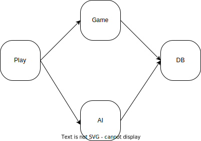
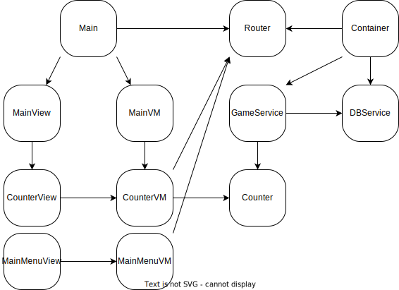

# Counter

## Goal

The goal of the Counter project is to get the project infrastructure setup with simple use cases.

## Use Cases
- Must have a main menu where a game can be selected. Test will be on the only selection for now
- TUI must include features that read and write to persistence
- TUI must include a feature that runs a simple algorithm
- Must setup Tokio
- Must setup logging

## In scope
- Play workspace
- AI workspace
- Game workspace
- DB workspace

## Out of scope
- Simluate workspace
- Train workspace

## Overview

**Workspaces to be created**

**Class Diagram**

A simple counter will be used to get end-to-end infrastructure setup. The schema will be as follows:

### Schema
| Field | Type   |
|-------|--------|
| Count | Numer  |
| Name  | String |

### Keyboard commands
#### Global
| Key | Command      |
|-----|--------------|
| o   | view logging |

#### Main Menu

| Key             | Command                 |
|-----------------|-------------------------|
| q               | quit program            |
| direction keys  | make selection for game |
| enter           | make selection          |

#### Counter

| Key             | Command     |
|-----|-------------------------|
| q   | quit to main menu       |
| a   | add one to count        |
| m   | minus one from count    |
| s   | saves the current count |
| l   | loads the count         |

## Implementation

- Infrastructure
  - Delete old code files
  - Setup workspaces
    - Play
    - Game
    - AI
    - DB
  - Rust husky setup
  - Setup Sea-orm
  - Setup Tokio
  - Setup ratatui
  - Setup logger
- Implementation
  - Game Service
  - Main Menu and Router
  - Counter
- Done